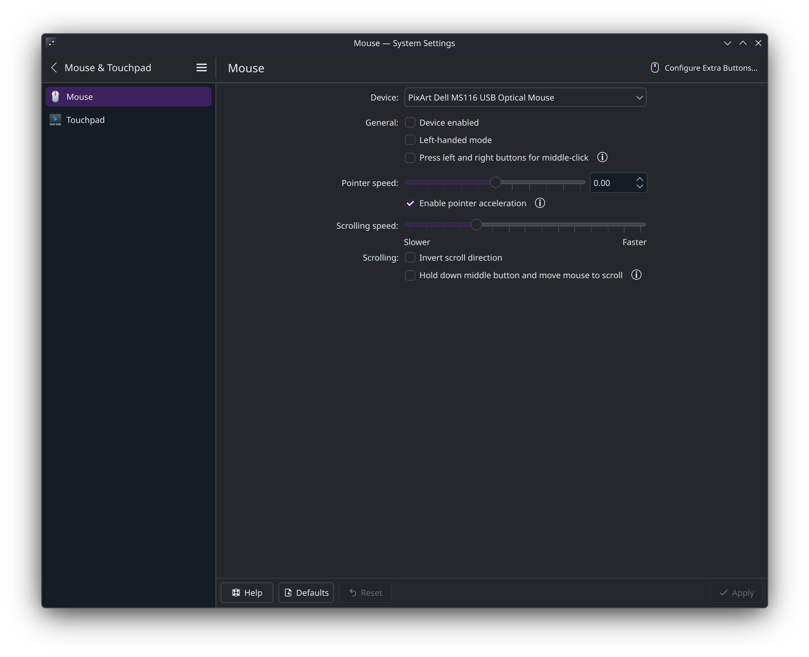
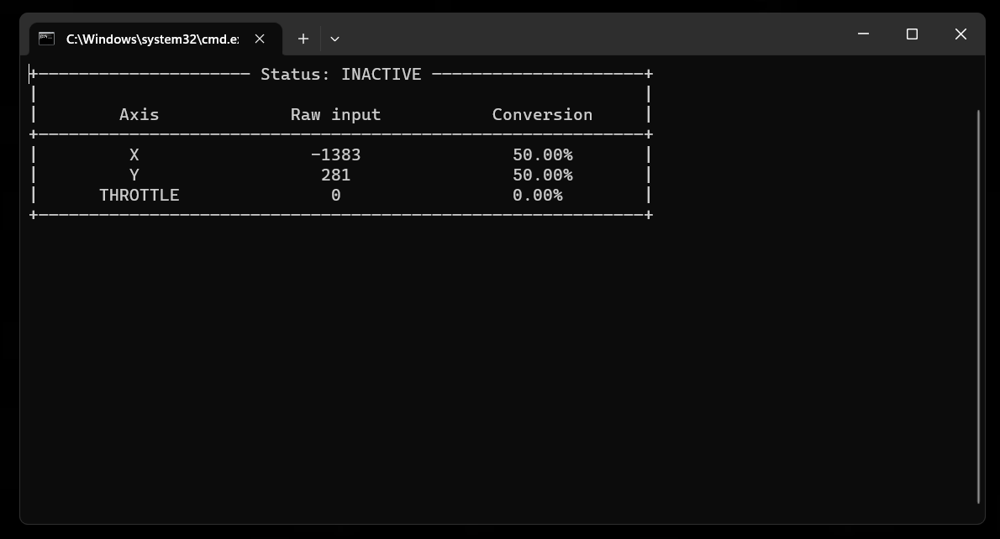
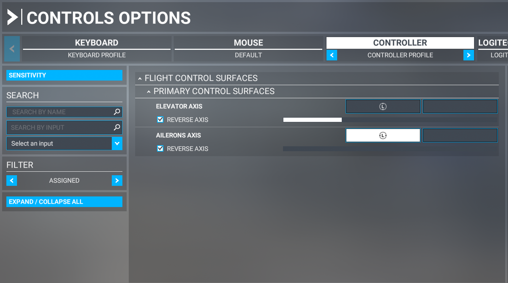
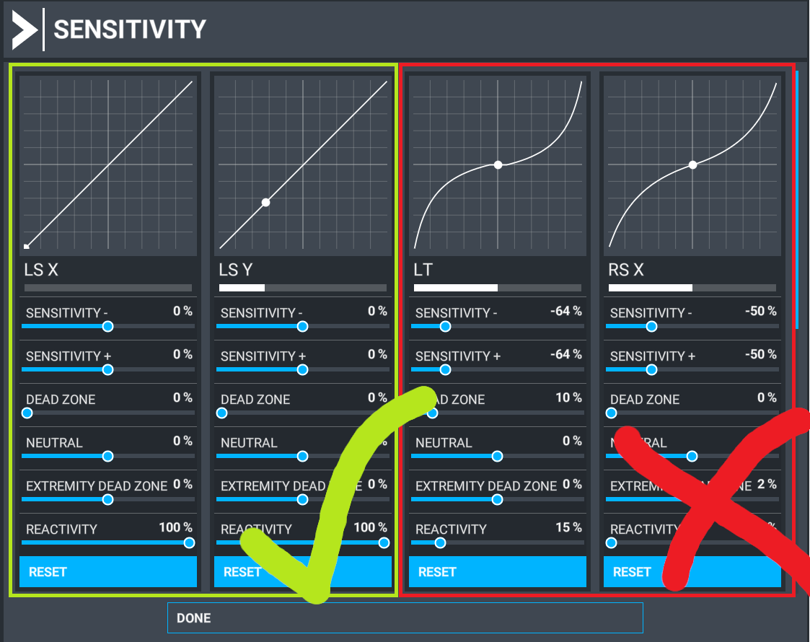

# msfs_mouse_yoke

This was forked from https://github.com/matiaspedelhez/msfs_mouse_yoke to 
customize a little for Linux. The work that was previously done is greatly
appreciated.

This is a small script written in Python that lets you fly with your mouse in 
Microsoft Flight Simulator 2020. (Why is this not implemented in the game yet?).
It also includes a throttle axis (technically right joystick X axis) and two
buttons (Left and Right click mapped to A and B).


## How does it work?

The script is always listening for the mouse position of a device you pick and 
it transforms that into an xbox controller input. It also listens for the scroll
wheel position, that way, you can use it as a throttle.


## Installation

1. Download and install [Python](https://www.python.org/).
2. Download and install [git](https://git-scm.com/install/).
3. Clone this repo (`git clone https://github.com/tyzbit/msfs_mouse_yoke`)
4. Configure the script as you like! 
  > You can modify the text file 'config.json'
5. sudo apt-get install python3-tk python3-dev
6. pip3 -r requirements.txt

```javascript
// config.json

{ 
    "master_key": ",",
    "mouse_sensitivity_x": 0.002,
    "mouse_sensitivity_y": 0.002,
    "throttle_segments": 10,
    "center_xy_axes_key": ".",
    "display_gui": true
}

```

## Usage

 1. python3 mouse_yoke.py [event device ID - optional]
 2. Pick the device to read from if the ID wasn't provided.
 3. To activate the script, press the **master_key**. Default key is comma ",".
 4. If possible, disable the mouse in KDE so you can still use your cursor normally.


    


## Settings in detail

1. "master_key": "," | The key for turning on/off the script.
2. "throttle_segments": 10 | How many scroll-wheel steps are required to go from 0% to 100% throttle.
3. "mouse_sensitivity_x/y": 0.002 | Sensitivity multiplier. Affects granularity of control.
4. "center_xy_axes_key": "." | The key for centering the yoke axes. Note, this does not center the throttle.
5. display_gui": true | Control whether the GUI showing the status is shown.

## Keep in mind that...
- When you are setting up the bindings in the game, I recommend removing ALL bindings that are set by default for xbox controllers, and leaving only the axis that you need (which are only two).\


- Clear all the "filters" that the game adds to the xbox controller. Leave it as raw as you can.\


- If you can disable the mouse in your OS, that's highly recommended (and the
reason this was forked and rewritten in the first place, so the real mouse
wouldn't be manipulated)

Happy flying!
