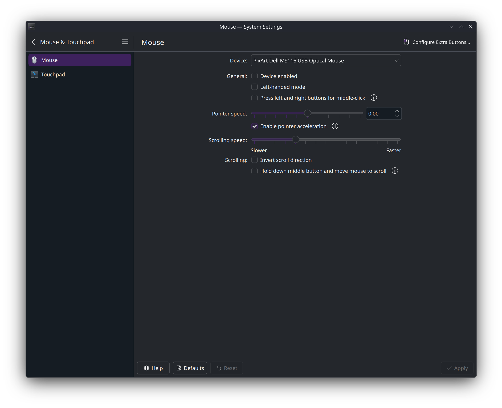
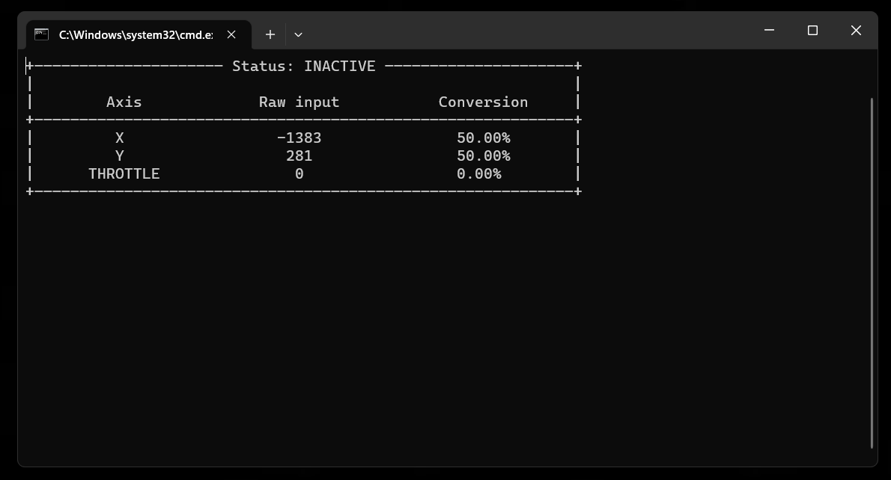
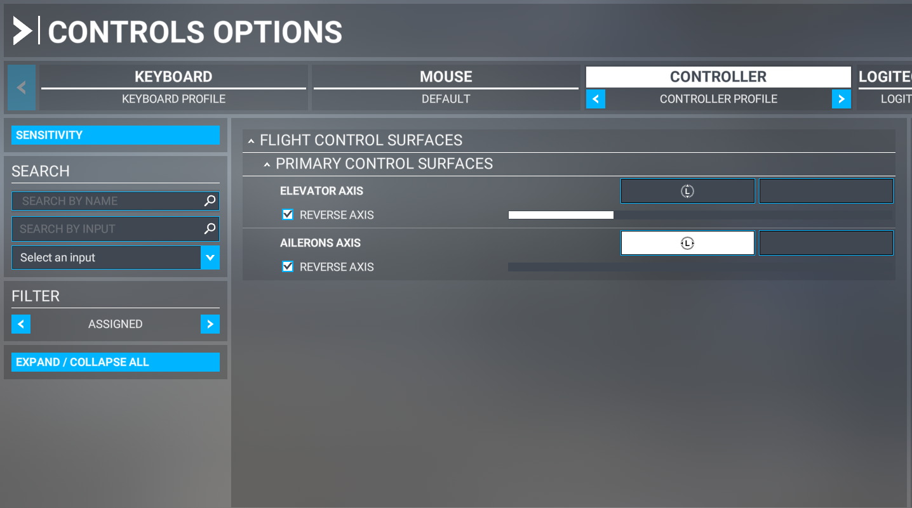
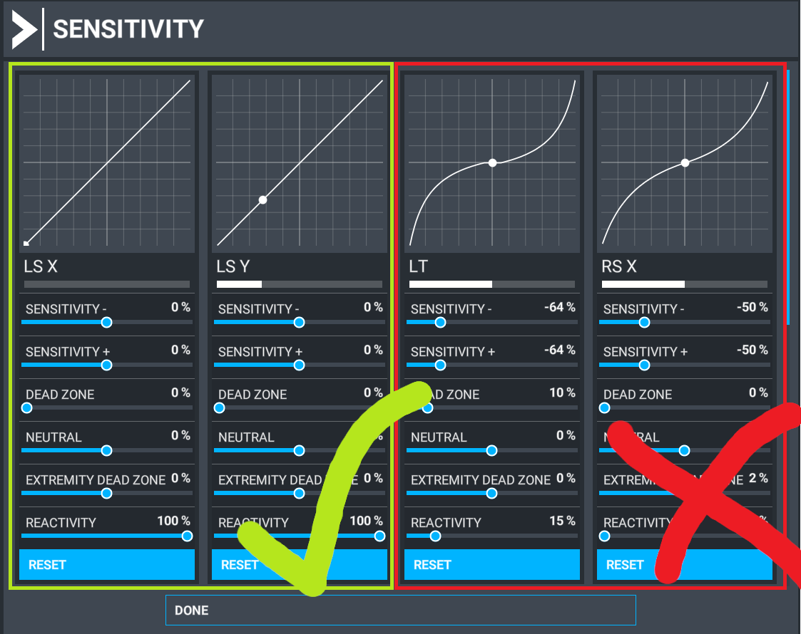

# msfs_mouse_yoke

This was forked from https://github.com/matiaspedelhez/msfs_mouse_yoke to 
customize a little for Linux. The work that was previously done is greatly
appreciated.

This is a small script written in Python that lets you fly with your mouse in 
Microsoft Flight Simulator 2020. (Why is this not implemented in the game yet?).
It also includes a throttle axis (technically right joystick X axis) and two
buttons (Left and Right click mapped to A and B).


## How does it work?

The script is always listening for the mouse position of a device you pick and 
it transforms that into an xbox controller input. It can do this for two mice at
once (each mouse is the X and Y of the left or right thumbstick). It also
listens for the scroll wheel position from the first mouse, that way you can use
it as a throttle.


## Installation

1. Download and install [Python](https://www.python.org/).
2. Download and install [git](https://git-scm.com/install/).
3. Clone this repo (`git clone https://github.com/tyzbit/msfs_mouse_yoke`)
4. Configure the script as you like! 
  > You can modify the text file 'config.json'
5. sudo apt-get install python3-tk python3-dev
6. pip3 -r requirements.txt

```yaml
# config.yaml
activation_key: Key.shift_r # This turns on the virtual controller
center_xy_axes_key: Key.alt_r # Calibrate
display_gui: false # Show a small window in the top left with the status
start_active: true # Turn the virtual controller on immediately at start
update_frequency: 95 # How many times per second to report values. Best not to exceed 100.
primary_mouse: &primary_mouse
  smoothing: 30 # Average using the last X measurements. Higher numbers increase perceived input lag.
  swap_axes: false # Swap axes, though MSFS can map any axis to any control
  absolute: false # Mice are relative, other devices can be either.
  sensitivity:
    x: 0.05 # If using absolute, the sensitivity should probably be 20 or more
    y: 0.05
secondary_mouse: *primary_mouse # This is a YAML trick to set up the secondary mouse the same as the primary
throttle_segments: 10 # Throttle is increased by 10% (100/10). Another example: 20 -> 5% (100/20)
```

## Usage

It's recommended to start this script before launching Microsoft Flight
Simulator.

 1. python3 mouse_yoke.py [event device ID - optional]
 2. Pick the device to read from if the ID wasn't provided.
 3. To activate the script, press the **master_key**. Default key is comma ",".
 4. If possible, disable the mouse in KDE so you can still use your cursor normally.

Instead of the event device ID you can also provide a string (regex allowed) to
look for a device with that name. This is useful because event device IDs are not
deterministic.


    



## Keep in mind that...
- When you are setting up the bindings in the game, I recommend removing ALL bindings that are set by default for xbox controllers, and leaving only the axis that you need (which are only two).\


- Clear all the "filters" that the game adds to the xbox controller. Leave it as raw as you can.\


- If you can disable the mouse in your OS, that's highly recommended (and the
reason this was forked and rewritten in the first place, so the real mouse
wouldn't be manipulated)

- If the map constantly spins, deactivate and then calibrate. Make sure to 
reactivate when you load in.

Happy flying!
